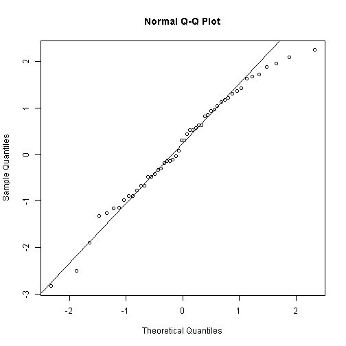

## The QQ plot 

Plotting the quantiles of a sample distribution against quantiles for the standard normal distribution gives a visual for the normality of the sample. Generally, the better the points line up with the qq-line, the more normal the distribution.

--- .class #id 

## Example

 

---

## Motivation

Interpretation can be difficult. perfectly normal but moderate-sized samples may not trace out the qq-line perfectly, as seen below.

 

---

## Heavy Tails

A points from a distribution with heavy tails will follow a curve that starts below the qq-line on the left and ends above the qq-line on the right.
 

--- 

### Large Normal Sample

Points from a large, normal sample will lie close to the qq-line except near the ends.

 

